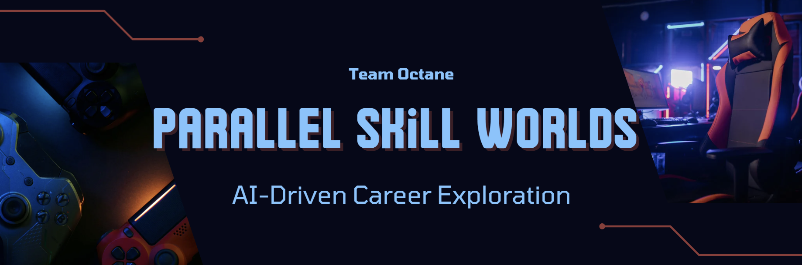
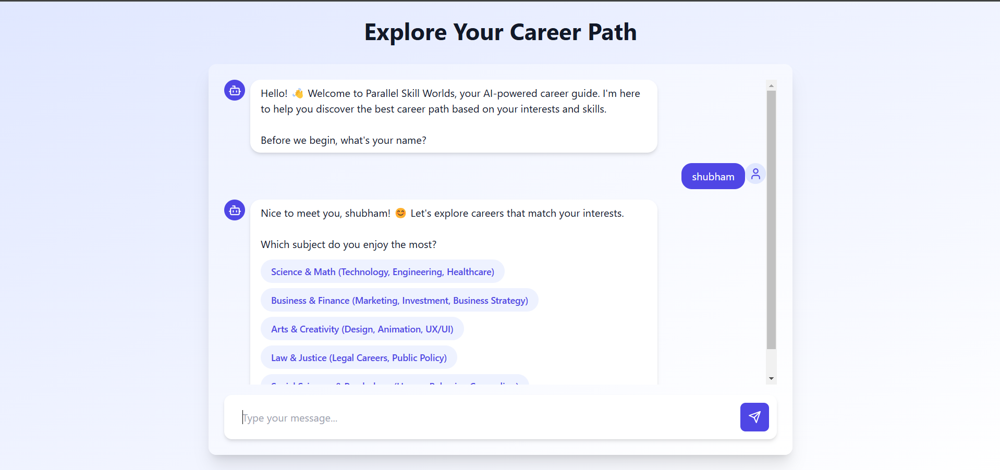
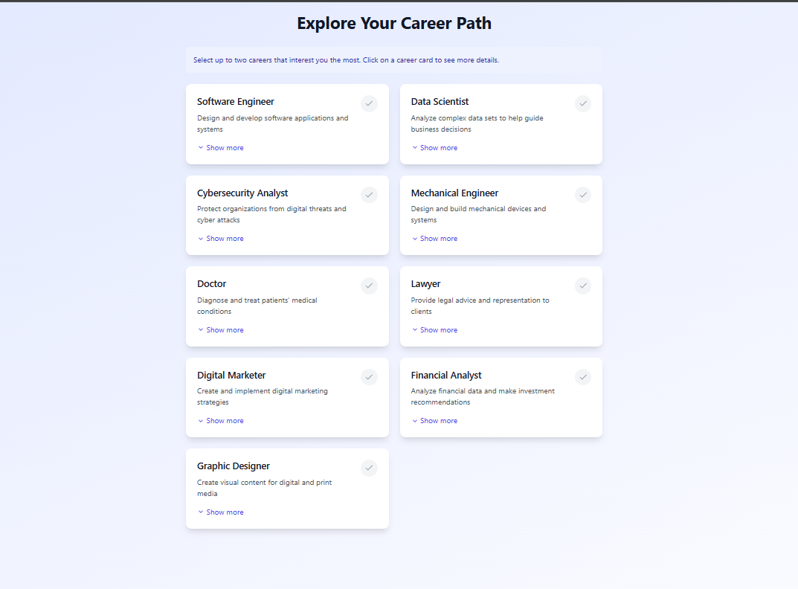
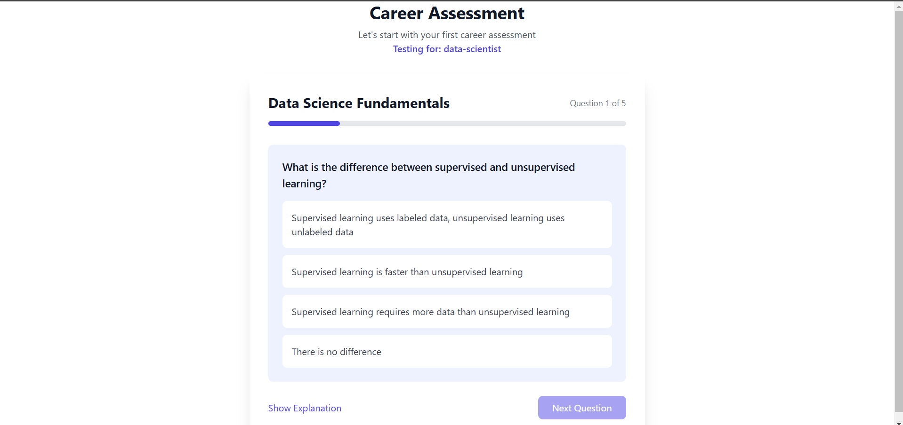
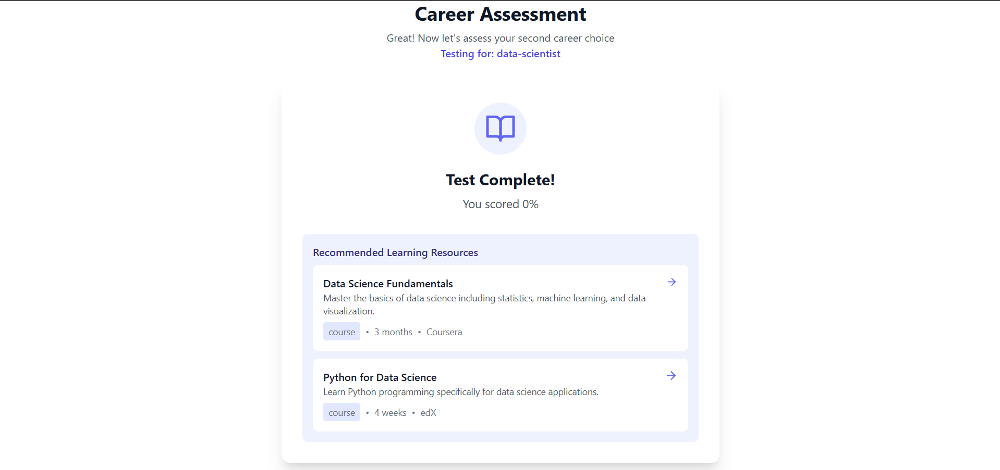

# 🚀 Parallel Skill Worlds – AI-Driven Career Exploration

> *🌟 AI-powered career guidance platform built with React, TypeScript, and Supabase! 🌟*  
> Explore careers, take mock tests, and track your learning progress – all in one place.

---

## 📌 Table of Contents
- [✨ Features](#-features)
- [🛠️ Tech Stack](#-tech-stack)
- [🚀 Installation Guide](#-installation-guide)
- [📸 Screenshots](#-screenshots)
  
---

## ✨ Features
✅ *AI-Powered Career Advisor* – Personalized career recommendations  
✅ *Mock Tests & Instant Feedback* – Assess skills for chosen career paths  
✅ *Secure Authentication* – Supabase-powered login system  
✅ *Career Dashboard* – Track progress & study resources  
✅ *Modern UI/UX* – Built with *React + Tailwind CSS*  
✅ *Fast & Efficient* – Uses *Vite* for optimized performance  
✅ *TypeScript Powered* – Ensuring scalability & maintainability  

---

## 🛠️ Tech Stack
### *Frontend:*
- ⚛️ *React (TypeScript)* – Interactive UI  
- 🎨 *Tailwind CSS* – Responsive & modern styling  
- ⚡ *Vite* – Ultra-fast build tool  

### *Backend:*
- 🏪 *Supabase (PostgreSQL)* – Authentication & database storage  
- 🔐 *Supabase Auth* – Secure user authentication  

### *Other Tools:*
- 🧹 *ESLint* – Code linting for best practices  
- 🎭 *PostCSS* – Advanced styling enhancements  
- 🗄 *Database Migrations* – Supabase migration system  

---

## 🚀 Installation Guide
### 1️⃣ Clone the Repository
sh

git clone https://github.com/shubhampawar7438/EY_Project.git

cd EY_Project-main

### 2️⃣ Install Dependencies
sh

npm install

### 3️⃣ Configure Supabase
- Create a *Supabase project*  
- Copy the *API keys* and update .env:
env
VITE_SUPABASE_URL=your-supabase-url
VITE_SUPABASE_ANON_KEY=your-anon-key

### 4️⃣ Start the Development Server
sh
npm run dev

🚀 *Visit:* http://localhost:3000/

---

## 📸 Screenshots

### 🗨️ AI Chatbot

___

### 🎯 Career Selection

___

### 📝 Mock Tests

___

### 📊 Dashboard

___
